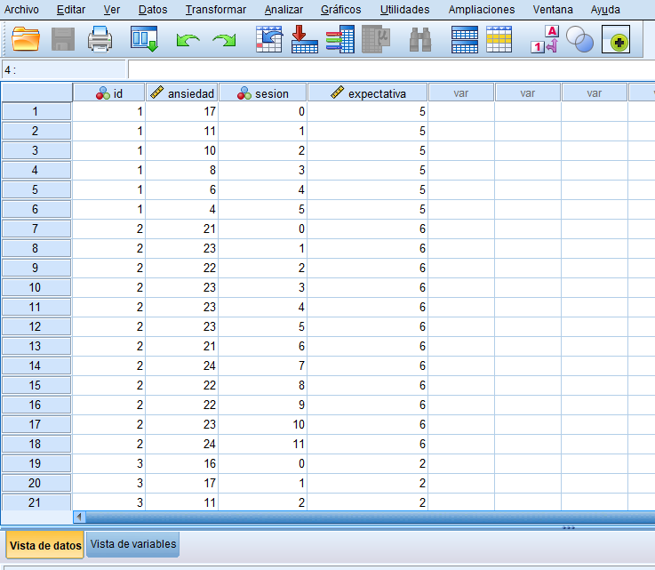
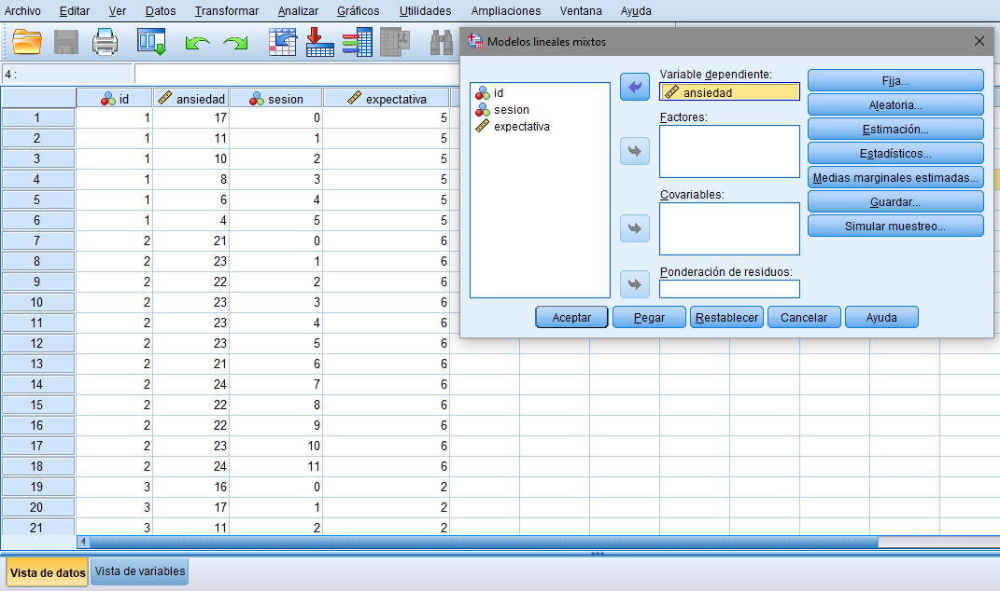
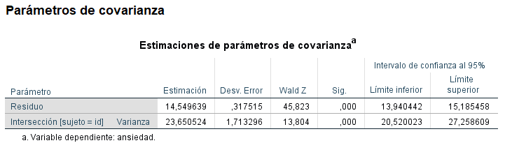

Esta página esta asociada a la presentación: <strong> Visión Crítica del Análisis de Varianza: Modelos de Curvas de Crecimiento como Alternativa para los Diseños de Medidas Repetidas </strong> que estuvo disponible del 9 de Julio al 11 de Julio de 2021 en el V Congreso Nacional de Psicología.

El objetivo de esta página es facilitar al investigador aplicado una guía para ajustar modelos de curvas de crecimiento a datos recogidos bajo diseños longitudinales. La guía está disponible para los softwares de Rstudio (versión 4.0.4) y SPSS (versión 25). 

La base de datos utilizada en la guía está extraida de: <em> Hoffman, L. (2015).Longitudinal analysis: Modeling within-person fluctuation and change. Routledge. </em>

La base de datos utilizada como ejemplo recogió un total de 429 pacientes diagnosticados de fobia social severa. Pretendía comprobar el efecto de una terapia de inundación sobre dichos pacientes, la cual consistía en su participación en una exposición de 10 minutos sobre un tema previamente pactado, acudiendo como público estudiantes de prácticas. El número de sesiones aplicadas oscilaba entre 3 y 12, ya que existía la posibilidad de que los sujetos dejaran de asistir a las mismas en caso de manifestar ansiedad baja; dicho nivel era medido a través de una escala de 0 a 30 puntos que el sujeto debía completar durante la exposición en público, siendo considerada como baja una puntuación menor de 5. Por último, cabe destacar la medición de las expectativas de todos los participantes acerca de la terapia, a través de una escala del 0 al 10. 

Si no está familiarizado con los modelos multinivel le recomendamos estos manuales:  
- <em> Hoffman, L. (2015).Longitudinal analysis: Modeling within-person fluctuation and change. Routledge. </em>  
- <em> Pardo, A., & Ruíz, M.A. (2012). Análisis de datos en ciencias sociales y de la salud III.Síntesis, Madrid
 </em>

Queremos recordar que la manera de ajustar un modelo multinivel es mediante la comparación de diferentes modelos y finalmente la interpretación del modelo que mejor ajuste demuestra. En esta guía partimos del modelo nulo y vamos añadiendo diferentes efectos hasta llegar al modelo final. 


# Modelo de curvas de crecimiento en SPSS
Un aspecto importante para tener en cuenta a la hora de aplicar modelos multinivel en SPSS es el formato de los datos. Definimos dos tipos: Long, donde cada medida del sujeto realizada en un determinado momento ocupa una fila, y Wide, donde las variables ocupan siempre las columnas y los sujetos cada fila. Mientras que el segundo es usado para los análisis de varianza, el primero es imprescindible para la aplicación de un modelo multinivel.  
  
<em> Formato Long de la base de datos de ejemplo </em>


## Modelo nulo
En primer lugar, ponemos a prueba el modelo nulo, similar a una regresión. El objetivo del mismo es calcular qué parte de la varianza de la variable dependiente (es decir, de las puntuaciones en ansiedad) es atribuible a las diferencias intrasujeto o intersujeto, lo cual permitirá determinar si es necesario considerar un modelo multinivel o si, por el contrario, conviene utilizar otros análisis más sencillos.

Seleccionamos la opción **Modelos mixtos – Lineales** del menú **Analizar**, para acceder al cuadro de diálogo: *Modelos lineales mixtos especificar sujetos y medidas repetidas*.  


  
Seleccionamos la variable que recoge el número de identificación del sujeto y la arrastramos a la caja **Sujetos**. A continuación, aceptamos los cambios realizados:  
  

Arrastramos la variable *Ansiedad* (nuestra VI) a **Variable dependiente**. Las variables independientes serán incluidas en modelos posteriores.  

  

A continuación, pulsamos el botón **Estimación** y marcamos la casilla Máxima verosimilitud. Máxima verosimilitud restringida solo será empleada en caso de contar con una cantidad pequeña de sujetos, menor de 20.  

  

Volvemos a la pestaña anterior al presionar **Continuar** y pulsamos el botón **Estadísticos**. Marcamos las casillas *Resumen del procesamiento de los casos*, *Estimaciones de los parámetros para efectos fijos* y *Contrastes sobre los parámetros de covarianza*.  

  

Finalmente, volvemos a la pestaña anterior al presionar **Continuar** y pulsamos el botón **Aleatoria**. Arrastramos nuestra variable id desde **Sujetos** hasta **Combinaciones** y marcamos la casilla que aparece en la parte superior, la cual indica *Incluir intersecciones*. Pulsamos **Continuar** y aceptamos todos los cambios realizados para obtener los primeros análisis.  

  

Nos interesan las siguientes tablas:  

•	*Criterios de información*, que incluye la desvianza del modelo, lo cual nos será útil para compararlo con futuros modelos multinivel.  

•	*Efectos fijos* (tanto pruebas de efectos fijos como estimaciones de efectos fijos), que nos permite contrastar la hipótesis nula de que el nivel medio de ansiedad de las personas que participan en el estudio es igual a cero, así como ofrece una estimación de este valor.  

  

•	*Parámetros de covarianza*, también denominados efectos aleatorios. En este caso, se contrastan las hipótesis nulas de que las diferencias intrasujeto (o relativas a los momentos temporales, representadas en la tabla como residuos) e intersujeto (representadas en las tablas como intersección) son cero. Su rechazo nos permite concluir la importancia de emplear modelos multinivel.  

  

Para no basarnos solo en la significación estadística, conviene hacer el cálculo del índice de correlación intraclase, el cual no es ofrecido por el programa SPSS: nos permite conocer el grado en que la varianza total de las puntuaciones de los participantes depende de su propia variabilidad (es decir, de las diferencias entre medidas repetidas) y no de aspectos que les definen y los distinguen de otros participantes, como puede ser en este caso las expectativas u otros (sexo, edad, comorbilidad…). El cálculo se realiza de la siguiente forma:


$$ICC= \frac{VAR (residuos)}{VAR (residuos)+ VAR (intersecciones)}$$
  
  
Consideramos como relevantes valores superiores a 0,15.

## Modelo con intersecciones aleatorias y el tiempo como predictor lineal 
El siguiente modelo que ponemos a prueba incluye nuestra primera variable independiente, de nivel uno, es decir, el tiempo. Aquí se pueden incluir tantas variables de nivel uno como se desee. De nuevo, seleccionamos la opción **Modelos mixtos – Lineales** del menú **Analizar**, para acceder al cuadro de diálogo *Modelos lineales mixtos*: especificar sujetos y medidas repetidas. Presionamos **Continuar** y, a continuación, arrastramos nuestra variable independiente **Sesión** a la caja **Covariable**.  

  

Pulsamos el botón **Fija** y arrastramos nuestra variable independiente hasta **Modelo** gracias al botón **Añadir**. Pulsamos **Continuar** y aceptamos todos los cambios realizados para obtener los resultados  

  

Nos interesan las siguientes tablas:  

•	*Criterios de información*. Gracias a estos datos compararemos el modelo ajustado previamente con el ajustado ahora. Debemos calcular a partir de esta información un estadístico denominado como razón de verosimilitudes, G2, que se distribuye según X2 con 1 grado de libertad en este caso. Los grados de libertad se calculan restando el número de parámetros de este modelo y el del anterior, información que aparece en la tabla superior Dimensión del modelo. El cálculo del estadístico se realiza de la siguiente forma:
$$G2 = -2LL_ {Modelo1} – (-2LL_{Modelo2})$$
Las dos cifras aparecen en la primera fila de la tabla Criterios de información de cada respectivo resultado. Deberemos atender a la tabla de Chi-cuadrado para comprobar si el valor del estadístico es lo suficientemente grande. En ese caso, se rechaza la hipótesis nula de que el nuevo modelo ajusta igual de bien que el anterior, y como consecuencia, nos quedamos con el último calculado. En caso de que el valor de G2 sea lo suficientemente bajo como para no poder rechazar la hipótesis nula, no continuamos realizando análisis estadísticos y nos quedamos con el modelo anterior.  


  
  
•	**Efectos fijos** (tanto pruebas de efectos fijos como estimaciones de efectos fijos). Por un lado, se contrastan las hipótesis nulas de que la intersección (es decir, nivel medio de ansiedad en los participantes) y las pendientes medias de las personas (es decir, el efecto del tiempo sobre las puntuaciones de ansiedad) son cero. Por otro lado, el coeficiente asociado a la variable *Sesión* permite estimar en qué grado cambia el nivel de ansiedad por cada sesión que avanzamos (en este caso, cómo disminuye 0,6 puntos el nivel de ansiedad por cada sesión en la que avanza el participante).  

  

•	**Parámetros de covarianza**, también denominados efectos aleatorios. Volvemos con el contraste de las hipótesis nulas que afirman que las diferencias intrasujeto e intersujeto son cero. Mientras que la segunda apenas cambiará, la primera sí, deberá verse reducida si la variable independiente es significativa.  


## Modelo con intersecciones y pendientes aleatorias y el tiempo como predictor lineal
Tras conocer que el avance de las sesiones produce cambios sobre las puntuaciones en ansiedad de los participantes, queda determinar si dicho cambio es distinto en cada sujeto, es decir, si existe variabilidad intersujeto en el efecto del tiempo sobre la ansiedad, y no solo en el nivel de ansiedad como hemos evaluado hasta el momento. Los pasos a realizar, que son aplicables para cualquier variable de nivel uno, son los siguientes: seleccionamos la opción **Modelos mixtos – Lineales** del menú **Analizar**, para acceder al cuadro de diálogo *Modelos lineales mixtos: especificar sujetos* y medidas repetidas. Presionamos **Continuar** y, a continuación, pulsamos el botón **Aleatoria**. Arrastramos nuestra variable independiente hasta **Modelo** gracias al botón **Añadir**. Además, accedemos al desplegable que tiene como opción por defecto **Componentes de la varianza**, situado en la parte de arriba del cuadro de diálogo Efectos aleatorios. Elegimos la opción **Sin estructura**. Pulsamos **Continuar** y aceptamos todos los cambios realizados para obtener los resultados.  

  

  

Nos interesan las siguientes tablas:  

•	**Criterios de información**. De nuevo, gracias a estos datos compararemos el modelo ajustado previamente con el ajustado ahora. Calculamos el estadístico de razón de verosimilitudes, G2, que se distribuye según X2 con 2 grado de libertad en este caso. Recordamos la fórmula:
$$G2 = -2LL_ {Modelo1} – (-2LL_{Modelo2})$$
  
En ese caso, se rechaza la hipótesis nula de que el nuevo modelo ajusta igual de bien que el anterior, y como consecuencia, nos quedamos con el último calculado.  

  

•	**Efectos fijos** (tanto pruebas de efectos fijos como estimaciones de efectos fijos). No ha habido apenas cambios puesto que no hemos añadido nuevos efectos fijos.  

  

•	**Parámetros de covarianza**, también denominados efectos aleatorios. Atendemos a cuatro fuentes de variación en este caso, las cuales debemos evaluar si son o no significativas.  

La varianza error de nivel uno, denominada en la tabla como residual y referida a diferencias intrasujeto; la varianza intersujeto en las puntuaciones de ansiedad al inicio del tratamiento, denominada como intersección NE(1,1); la varianza intersujeto de las pendientes de regresión que relacionan el tiempo con las puntuaciones de ansiedad, denominada como intersección NE (2,1); y covarianza entre intersecciones y pendientes, que permite comprobar si mayores o menores niveles de ansiedad al inicio implican un mayor o menor efecto del tiempo sobre dichos niveles a lo largo del paso de las sesiones. Aunque su interpretación excede esta breve guía sobre cómo realizar un análisis multinivel, pondremos un ejemplo claro para entender a qué puede referirse este apartado.  

Una covarianza negativa indica que los participantes con bajos niveles de ansiedad al inicio del tratamiento presentan una mayor mejora a lo largo de las sesiones, mientras que una covarianza positiva (como es el caso) señala que el efecto de la intervención a lo largo del tiempo es mayor en personas con altos niveles de ansiedad al inicio de la terapia.  


## Introduciendo variables de nivel 2

Para finalizar, incluiremos un último modelo a tener en cuenta (aunque podemos seguir introduciendo modelos que incluyan aspectos más complejos). Ahora, tenemos en cuenta variables de nivel dos, es decir, relativas al individuo, como puede ser el sexo, la edad, comorbilidad o, en este caso, las expectativas con respecto a la terapia. De nuevo, seleccionamos la opción **Modelos mixtos – Lineales** del menú **Analizar**, para acceder al cuadro de diálogo *Modelos lineales mixtos: especificar sujetos y medidas repetidas*. Presionamos **Continuar** y, a continuación, arrastramos nuestra variable independiente **Expectativas** a la caja **Covariable**. En caso de tratarse de una variable categórica, debemos llevarla a la caja **Factores**.  

  

Pulsamos el botón **Fija** y arrastramos esta nueva variable independiente hasta **Modelo** gracias al botón **Añadir**. Es posible incluir un efecto de la interacción entre las dos variables independientes si seleccionamos ambas manteniendo la tecla *Ctrl* y las incluimos a la vez gracias al botón **Añadir** que aparece en el cuadro. En este caso, no consideraremos la interacción. Pulsamos **Continuar** y aceptamos todos los cambios realizados para obtener los resultados.  

  

Nos interesan las siguientes tablas:  

•	**Criterios de información**. De nuevo, gracias a estos datos compararemos el modelo ajustado previamente con el ajustado ahora. Calculamos el estadístico de razón de verosimilitudes, G2, que se distribuye según X2 con 2 grado de libertad en este caso. Recordamos la fórmula:
$$G2 = -2LL_ {Modelo1} – (-2LL_{Modelo2})$$

  
En ese caso, se rechaza la hipótesis nula de que el nuevo modelo ajusta igual de bien que el anterior, y como consecuencia, nos quedamos con el último calculado.  

  

•	**Efectos fijos** (tanto pruebas de efectos fijos como estimaciones de efectos fijos). Por un lado, se contrastan de nuevo las hipótesis nulas de que la intersección (es decir, nivel medio de ansiedad en los participantes) y el efecto del tiempo son cero. Añadimos además la hipótesis nula sobre el efecto nulo de las expectativas sobre los niveles de ansiedad. La tabla de Estimaciones de efectos fijos permiten hacer predicciones sobre los niveles medios de ansiedad en los participantes en base a sus expectativas y la sesión en la que se encuentran.  

  

•	**Parámetros de covarianza**, también denominados efectos aleatorios. De nuevo, se valora si son nulos los siguientes parámetros: la varianza error de nivel uno o diferencias intrasujeto, la varianza intersujeto en las puntuaciones de ansiedad al inicio del tratamiento, la varianza intersujeto de las pendientes de regresión que relacionan el tiempo con las puntuaciones de ansiedad y la covarianza entre intersecciones y pendientes.  

  

## Modelo final

Puede darse el caso en el que, la introducción de variables de nivel 1 y 2 acaben reduciendo a cero los componentes de la varianza intersujeto, recogidos en la fila de intersección. En nuestro ejemplo, ya desde el modelo anterior, hemos comprobado que la variabilidad de las pendientes o NE (2,1) no es estadísticamente significativa, es decir, que el efecto del tiempo es el mismo para todos los sujetos. Es por ello que conviene crear un nuevo modelo que elimine este aspecto, más simple, siguiendo estos pasos:  

Seleccionamos **Modelos mixtos – Lineales** del menú **Analizar**, para acceder al cuadro de diálogo Modelos lineales mixtos: especificar sujetos y medidas repetidas. Presionamos **Continuar** y, a continuación, pulsamos el botón **Aleatoria**. Eliminamos del cuadro Modelo la variable de nivel uno, **Sesión**, puesto que sus efectos aleatorios han sido reducidos (por tanto, es un parámetro que vale cero y no necesita ser incluido). Esto simplifica los resultados a considerar.


# Modelo de curvas de cremiento en R studio 
Necesitamos instalar el paquete `lme4` y `lmerTest`en el caso de que no lo tengamos: 

```{r, eval=F}
install.packages ("lme4")
install.packages("lmerTest")
```

A continuación, cargamos los paquetes: 
```{r, eval=T, message=F, warning=F}
library (lme4)
library (lmerTest)
```

También tenemos que cargar la base de datos. En nuestro caso la extensión del archivo es .txt. Si tus datos tienen otra extensión y no sabes como leerlos puedes consultar [aquí](https://bookdown.org/matiasandina/R-intro/leer-datos.html). Además, `lme4`, utiliza bases de datos en formato <strong> long </strong>. Si necesitas transformar tu base de datos de formato <strong> wide </strong> a formato <strong> long </strong>, puedes consultar [aquí](https://www.maximaformacion.es/blog-dat/como-modificar-el-formato-de-tus-datos-de-manera-sencilla/). 

De esta manera cargamos la base de datos: 

```{r, eval=T}
data.long <- read.table ("Curvas de crecimiento.txt", header =T)
```
La estructura de la base de datos es esta: 
```{r, eval=T}
head (data.long, n=30)
data.long$id <- as.factor (data.long$id)
```
## Modelo nulo

En primer lugar, ajustamos el modelo nulo, que solo incluye la variable dependiente del estudio, la *ansiedad*: 
```{r, eval=T}
M.nulo <-  lmer(ansiedad ~ (1|id),data=data.long)
summary(M.nulo)
```
Con la información de este modelo, podemos evaluar si es necesario aplicar un modelo de curvas de crecimiento a estos datos mediante el cálculo del índice de correlación intraclase. 
```{r, eval=T}
var.intersecciones <- 23.71
var.residual <- 14.55
ICC <- var.intersecciones/(var.intersecciones+var.residual); ICC
```
Como un 61.97% de la varianza se explica por diferencias entre individuos, tiene sentido aplicar un modelo de curvas de crecimiento a estos datos. En este modelo la intersección ("Intercept") solo informa de la media de `ansiedad` en la muestra. 


## Modelo con intersecciones aleatorias y el tiempo como predictor lineal 

```{r, eval=T}
M.intersecciones <-  lmer(ansiedad ~ sesion + (1|id),data=data.long)
summary (M.intersecciones)

```
**Interpretación de los efectos fijos**  
En esta parte se contrastan las hipótesis nulas de que la intersección (es decir, nivel medio de ansiedad en los participantes) y las pendientes medias de las personas (es decir, el efecto del tiempo sobre las puntuaciones de ansiedad) son cero. Por otro lado, el coeficiente asociado a la variable *Sesión* permite estimar en qué grado cambia el nivel de ansiedad por cada sesión que avanzamos (en este caso, cómo disminuye 0,6 puntos el nivel de ansiedad por cada sesión en la que avanza el participante).  

**Interpretación de los efectos aleatorios**  

Se contrastan las hipótesis nulas que afirman que las diferencias intrasujeto e intersujeto son cero. Mientras que la varianza de las intersecciones apenas cambiará, la pde los residuos deberá verse reducida si la variable independiente es significativa.  

Para comparar este modelo con el anterior: 
```{r, eval=T}
anova (M.nulo,M.intersecciones)
```
Como esta comparación es significativa, el modelo de intersecciones aleatorias explica mejor la varianza de estos datos que el modelo nulo. 

## Modelo con intersecciones y pendientes aleatorias y el tiempo como predictor lineal
Ahora vamos a comprobar si el modelo que refleja diferencias en la manera que se produce el cambio en ansiedad de las personas ajusta mejor que el que solo tiene momentos iniciales distintos. 
```{r, eval=T}
M.pendientes <-  lmer(ansiedad ~ sesion + (sesion|id),data=data.long)
summary (M.pendientes)

```
  
**Interpretación de los efectos fijos**  

Apenas han cambiado puesto que nohemos introducido ningún efecto fijo nuevo. La interpretación del apartado anterior es válida.  

**Interpretación de los efectos aleatorios**  

La correlación entre la sesión y la intersección, al ser negativa, indica que cuanto mayor es la ansiedad en el momento inicial, mayor es el descenso de la misma a través de las sesiones. 

Para comparar este modelo con el anterior: 
```{r, eval=T}
anova (M.intersecciones,M.pendientes)
```
Este modelo ajusta mejor que el anterior, por lo que la puntuación en ansiedad además de ser diferente para los participantes en el momento inicial y además el cambio en la puntuación de ansiedad a través del tiempo se produce de forma distinta en los participantes. 

## Introduciendo variables de nivel 2
Ahora que sabemos que la puntuación en ansiedad empieza en valores diferentes y disminuye de manera diferente en cada persona, podemos intentar explicar a qué se debe esa variabilidad entre los sujetos introduciendo la **expectativa** en el modelo. 

```{r, eval=T}
M.var2 <-  lmer(ansiedad ~ sesion + expectativa+ sesion*expectativa+ (sesion|id),data=data.long)
summary (M.var2)

```
**Interpretación de los efectos fijos**  

Por un lado, se contrastan de nuevo las hipótesis nulas de que la intersección (es decir, nivel medio de ansiedad en los participantes) y el efecto del tiempo son cero. Añadimos además la hipótesis nula sobre el efecto nulo de las expectativas sobre los niveles de ansiedad. La estimaciones de efectos fijos permiten hacer predicciones sobre los niveles medios de ansiedad en los participantes en base a sus expectativas y la sesión en la que se encuentran.


**Interpretación de los efectos aleatorios**  

Se valora en qué medida se han reducido las varianzas al incluir variables explicativas en el modelo. En este ejemplo concreto encontramos que todavía queda varianza de las intersecciones por explicar, sin embargo la **expectativa** consigue explicar totalmente la varianza de las pendientes. Aunque `lme4` no ofrece significación estadística para los efectos aleatorios vemos que el valor es muy pequeño y de hecho no alcanza la significación estadísitca.  


Para comparar este modelo con el anterior: 
```{r, eval=T}
anova (M.pendientes, M.var2)
```


Este modelo también es más explicativo que el anterior. 


## Modelo final
  
Puesto que hemos conseguido explicar totalmente la varianza de las pendientes, este parámetro es cero y conviene eliminarlo para estimar el modelo final. Su estimación se hace de la siguiente manera: 

```{r, eval=T}
M.final <-  lmer(ansiedad ~ sesion + expectativa+ sesion*expectativa+ (1|id),data=data.long)
summary (M.final)

```


